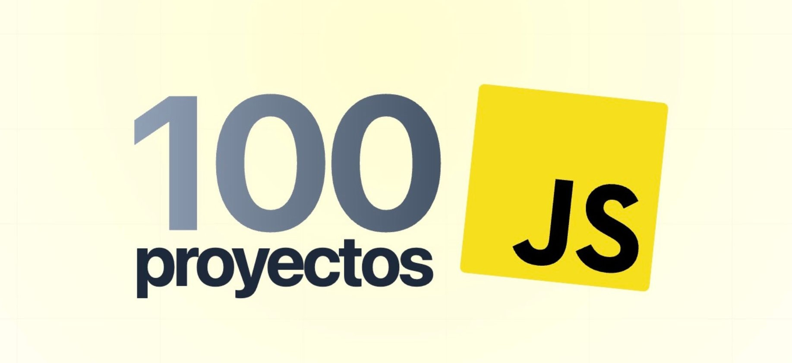

<div align="center">
    <a href="https://www.javascript100.dev">
     
    </a>
  <h3>
    <strong>100 proyectos de JavaScript con código y vídeos</strong>
  </h3>
</div>

<div align="center">
    <a href="https://www.javascript100.dev">
        Website
    </a>
    <span>&nbsp;❖&nbsp;</span>
    <a href="#-proyectos">
        Proyectos
    </a>
    <span>&nbsp;❖&nbsp;</span>
    <a href="#-contribuir">
        Contribuir
    </a>
    <span>&nbsp;❖&nbsp;</span>
    <a href="https://www.youtube.com/c/midudev">
        YouTube
    </a>
    <span>&nbsp;❖&nbsp;</span>
    <a href="https://twitter.com/midudev">
        Twitter
    </a>
    <span>&nbsp;❖&nbsp;</span>
    <a href="https://twitch.tv/midudev">
        Twitch
    </a>
</div>

<p></p>

<div align="center">


</div>

## ✨ Proyectos

|  #   | Proyecto         | Descripción                                                              | Código                                                                                                                                                                                   | Website                                                       |
| --- | ---------------- | ------------------------------------------------------------------------ | ---------------------------------------------------------------------------------------------------------------------------------------------------------------------------------------- | ------------------------------------------------------------- |
| 1   | **tinder-swipe** | Aprende a crear el efecto de swipe de Tinder con HTML, CSS y JavaScript. | [](https://github.com/midudev/javascript-100-proyectos/tree/main/01-tinder-swipe) | [](https://www.javascript100.dev/01-tinder-swipe) |
| 2   | **arkanoid-game** | Juego mítico y clásico de Arkanoid para controlar con teclado. | [](https://github.com/midudev/javascript-100-proyectos/tree/main/02-arkanoid-game) | [](https://www.javascript100.dev/02-arkanoid-game) |
| 3   | **mecanografía** | Pon a prueba a qué velocidad tecleas | [](https://github.com/midudev/javascript-100-proyectos/tree/main/03-midu-typing-game) | [](https://www.javascript100.dev/03-midu-typing-game) |
| 4   | **chatgpt-local** | Creamos un ChatGPT que se ejecuta en tu navegador. 100% privado y gratuito | [](https://github.com/midudev/javascript-100-proyectos/tree/main/04-chatgpt-local) | [](https://www.javascript100.dev/04-chatgpt-local) |
| 5   | **buscar-info-IP** | Llama a una api para obtener información de cualquier IP | [](https://github.com/midudev/javascript-100-proyectos/tree/main/05-api-geo-ip) | [](https://www.javascript100.dev/05-api-geo-ip) |
| 6   | **tetris-canvas** | Creamos el famoso juego tetris como desafío de una prueba técnica | [](https://github.com/midudev/javascript-100-proyectos/tree/main/06-tetris-canvas) | [](https://www.javascript100.dev/06-tetris-canvas) |
| 7   | **tier-maker** | Arrastra imágenes de cosas y ponlas en el nivel que creas | [](https://github.com/midudev/javascript-100-proyectos/tree/main/07-tier-maker) | [](https://www.javascript100.dev/07-tier-maker) |
| 8   | **excel-js** | Creamos una hoja de SpreadSheets editable | [](https://github.com/midudev/javascript-100-proyectos/tree/main/08-excel-js) | [](https://www.javascript100.dev/08-excel-js) |
| 9   | **paint-win-95** | El clásico editor de imágenes de Windows | [](https://github.com/midudev/javascript-100-proyectos/tree/main/09-paint-win-95) | [](https://www.javascript100.dev/09-paint-win-95) |
| 10   | **stack-game** | Stack Game en 2D | [](https://github.com/midudev/javascript-100-proyectos/tree/main/10-stack-game) | [](https://www.javascript100.dev/10-stack-game) |
| 11   | **js-perf-benchmark** | Benchmark con JS | [](https://github.com/midudev/javascript-100-proyectos/tree/main/11-js-perf-benchmark) | [](https://www.javascript100.dev/11-js-perf-benchmark) |
| 12   | **moto-scroll** | Animación de fondo por scroll | [](https://github.com/midudev/javascript-100-proyectos/tree/main/12-moto-scroll) | [](https://www.javascript100.dev/12-moto-scroll) |
| 13   | **google-translate** | Clon de Google Translate con traducción en tiempo real | [](https://github.com/midudev/javascript-100-proyectos/tree/main/13-google-translate) | [](https://www.javascript100.dev/13-google-translate) |
| 14   | **snake-game** | El clásico juego de la serpiente que crece al comer | [](https://github.com/midudev/javascript-100-proyectos/tree/main/14-snake-game) | [](https://www.javascript100.dev/14-snake-game) |
| 15   | **memory-game** | Encuentra todas las parejas de cartas con el menor número de movimientos | [](https://github.com/midudev/javascript-100-proyectos/tree/main/15-memory-game) | [](https://www.javascript100.dev/15-memory-game) |
| 16   | **pomodoro-timer** | Gestiona tu tiempo con la técnica Pomodoro y recibe notificaciones | [](https://github.com/midudev/javascript-100-proyectos/tree/main/16-pomodoro-timer) | [](https://www.javascript100.dev/16-pomodoro-timer) |
| 17   | **password-generator** | Genera contraseñas seguras de verdad y mide su fortaleza | [](https://github.com/midudev/javascript-100-proyectos/tree/main/17-password-generator) | [](https://www.javascript100.dev/17-password-generator) |
| 18   | **game-of-life** | Autómata celular de Conway donde patrones simples crean vida compleja | [](https://github.com/midudev/javascript-100-proyectos/tree/main/18-game-of-life) | [](https://www.javascript100.dev/18-game-of-life) |
| 19   | **weather-app** | Consulta el tiempo de tu ubicación o de cualquier ciudad | [](https://github.com/midudev/javascript-100-proyectos/tree/main/19-weather-app) | [](https://www.javascript100.dev/19-weather-app) |
| 20   | **drum-kit** | Toca la batería con el teclado. Sonidos sintetizados sin archivos de audio | [](https://github.com/midudev/javascript-100-proyectos/tree/main/20-drum-kit) | [](https://www.javascript100.dev/20-drum-kit) |
| 21   | **tic-tac-toe-ai** | Juega contra una IA que nunca pierde gracias al algoritmo minimax | [](https://github.com/midudev/javascript-100-proyectos/tree/main/21-tic-tac-toe-ai) | [](https://www.javascript100.dev/21-tic-tac-toe-ai) |
| 22   | **markdown-editor** | Escribe Markdown y míralo convertido a HTML en tiempo real | [](https://github.com/midudev/javascript-100-proyectos/tree/main/22-markdown-editor) | [](https://www.javascript100.dev/22-markdown-editor) |
| 23   | **sorting-visualizer** | Observa paso a paso cómo funcionan los algoritmos de ordenación | [](https://github.com/midudev/javascript-100-proyectos/tree/main/23-sorting-visualizer) | [](https://www.javascript100.dev/23-sorting-visualizer) |
| 24   | **color-palette** | Crea paletas de colores armoniosas pulsando la barra espaciadora | [](https://github.com/midudev/javascript-100-proyectos/tree/main/24-color-palette) | [](https://www.javascript100.dev/24-color-palette) |
| 25   | **whack-a-mole** | Golpea a los topos antes de que se escondan | [](https://github.com/midudev/javascript-100-proyectos/tree/main/25-whack-a-mole) | [](https://www.javascript100.dev/25-whack-a-mole) |
| 26   | **infinite-scroll** | Carga contenido automáticamente al llegar al final de la página | [](https://github.com/midudev/javascript-100-proyectos/tree/main/26-infinite-scroll) | [](https://www.javascript100.dev/26-infinite-scroll) |
| 27   | **2048-game** | Desliza y combina las fichas hasta llegar al 2048 | [](https://github.com/midudev/javascript-100-proyectos/tree/main/27-2048-game) | [](https://www.javascript100.dev/27-2048-game) |
| 28   | **pixel-art** | Dibuja pixel art y exporta tu creación como imagen PNG | [](https://github.com/midudev/javascript-100-proyectos/tree/main/28-pixel-art) | [](https://www.javascript100.dev/28-pixel-art) |
| 29   | **pokedex** | Explora los Pokémon de la primera generación con la PokeAPI | [](https://github.com/midudev/javascript-100-proyectos/tree/main/29-pokedex) | [](https://www.javascript100.dev/29-pokedex) |
| 30   | **emoji-picker** | Un selector de emojis nativo usando la Popover API | [](https://github.com/midudev/javascript-100-proyectos/tree/main/30-emoji-picker) | [](https://www.javascript100.dev/30-emoji-picker) |
| 31   | **minesweeper** | El mítico Buscaminas de Windows con sus tres niveles de dificultad | [](https://github.com/midudev/javascript-100-proyectos/tree/main/31-minesweeper) | [](https://www.javascript100.dev/31-minesweeper) |
| 32   | **text-diff** | Encuentra las diferencias entre dos textos como hace Git | [](https://github.com/midudev/javascript-100-proyectos/tree/main/32-text-diff) | [](https://www.javascript100.dev/32-text-diff) |
| 33   | **audio-visualizer** | Visualiza el sonido de tu micrófono o de un archivo de audio en tiempo real | [](https://github.com/midudev/javascript-100-proyectos/tree/main/33-audio-visualizer) | [](https://www.javascript100.dev/33-audio-visualizer) |
| 34   | **flappy-bird** | Esquiva las tuberías aleteando en este juego adictivo | [](https://github.com/midudev/javascript-100-proyectos/tree/main/34-flappy-bird) | [](https://www.javascript100.dev/34-flappy-bird) |
| 35   | **kanban-board** | Organiza tus tareas arrastrándolas entre columnas | [](https://github.com/midudev/javascript-100-proyectos/tree/main/35-kanban-board) | [](https://www.javascript100.dev/35-kanban-board) |
| 36   | **photo-booth** | Hazte fotos con la webcam y aplica filtros píxel a píxel | [](https://github.com/midudev/javascript-100-proyectos/tree/main/36-photo-booth) | [](https://www.javascript100.dev/36-photo-booth) |
| 37   | **wordle** | Adivina la palabra oculta de cinco letras en seis intentos | [](https://github.com/midudev/javascript-100-proyectos/tree/main/37-wordle) | [](https://www.javascript100.dev/37-wordle) |
| 38   | **web-components** | Crea tus propios elementos HTML reutilizables sin frameworks | [](https://github.com/midudev/javascript-100-proyectos/tree/main/38-web-components) | [](https://www.javascript100.dev/38-web-components) |
| 39   | **maze-generator** | Genera laberintos aleatorios y encuentra la salida automáticamente | [](https://github.com/midudev/javascript-100-proyectos/tree/main/39-maze-generator) | [](https://www.javascript100.dev/39-maze-generator) |
| 40   | **currency-converter** | Convierte entre monedas con tipos de cambio actualizados | [](https://github.com/midudev/javascript-100-proyectos/tree/main/40-currency-converter) | [](https://www.javascript100.dev/40-currency-converter) |
| 41   | **simon-says** | Memoriza y repite la secuencia de colores y sonidos | [](https://github.com/midudev/javascript-100-proyectos/tree/main/41-simon-says) | [](https://www.javascript100.dev/41-simon-says) |
| 42   | **interactive-particles** | Un campo de partículas que reacciona al movimiento del ratón | [](https://github.com/midudev/javascript-100-proyectos/tree/main/42-interactive-particles) | [](https://www.javascript100.dev/42-interactive-particles) |
| 43   | **js-quiz** | ¿Cuánto sabes de JavaScript? Pon a prueba tus conocimientos | [](https://github.com/midudev/javascript-100-proyectos/tree/main/43-js-quiz) | [](https://www.javascript100.dev/43-js-quiz) |
| 44   | **github-profile** | Busca cualquier usuario de GitHub y descubre sus repositorios | [](https://github.com/midudev/javascript-100-proyectos/tree/main/44-github-profile) | [](https://www.javascript100.dev/44-github-profile) |
| 45   | **pong** | El primer videojuego de la historia para uno o dos jugadores | [](https://github.com/midudev/javascript-100-proyectos/tree/main/45-pong) | [](https://www.javascript100.dev/45-pong) |
| 46   | **signature-pad** | Firma con el ratón, el dedo o un lápiz y descarga tu firma | [](https://github.com/midudev/javascript-100-proyectos/tree/main/46-signature-pad) | [](https://www.javascript100.dev/46-signature-pad) |
| 47   | **pathfinding** | Dibuja muros y mira cómo el algoritmo A* encuentra el camino más corto | [](https://github.com/midudev/javascript-100-proyectos/tree/main/47-pathfinding) | [](https://www.javascript100.dev/47-pathfinding) |
| 48   | **command-palette** | Una paleta de comandos al estilo VS Code que se abre con Cmd+K | [](https://github.com/midudev/javascript-100-proyectos/tree/main/48-command-palette) | [](https://www.javascript100.dev/48-command-palette) |
| 49   | **sudoku** | Juega al Sudoku o deja que el algoritmo lo resuelva por ti | [](https://github.com/midudev/javascript-100-proyectos/tree/main/49-sudoku) | [](https://www.javascript100.dev/49-sudoku) |
| 50   | **piano-synth** | Toca el piano con el teclado del ordenador y moldea el sonido | [](https://github.com/midudev/javascript-100-proyectos/tree/main/50-piano-synth) | [](https://www.javascript100.dev/50-piano-synth) |
| 51   | **image-compressor** | Reduce el peso de tus imágenes sin subirlas a ningún servidor | [](https://github.com/midudev/javascript-100-proyectos/tree/main/51-image-compressor) | [](https://www.javascript100.dev/51-image-compressor) |
| 52   | **hangman** | Adivina la palabra letra a letra antes de completar el dibujo | [](https://github.com/midudev/javascript-100-proyectos/tree/main/52-hangman) | [](https://www.javascript100.dev/52-hangman) |
| 53   | **spa-router** | Construye tu propio enrutador para aplicaciones de una sola página | [](https://github.com/midudev/javascript-100-proyectos/tree/main/53-spa-router) | [](https://www.javascript100.dev/53-spa-router) |
| 54   | **matrix-rain** | Recrea el icónico efecto de lluvia de código de Matrix | [](https://github.com/midudev/javascript-100-proyectos/tree/main/54-matrix-rain) | [](https://www.javascript100.dev/54-matrix-rain) |
| 55   | **expense-tracker** | Registra tus ingresos y gastos y visualízalos en un gráfico | [](https://github.com/midudev/javascript-100-proyectos/tree/main/55-expense-tracker) | [](https://www.javascript100.dev/55-expense-tracker) |
| 56   | **text-effects** | Efectos de máquina de escribir, scramble y más para tus textos | [](https://github.com/midudev/javascript-100-proyectos/tree/main/56-text-effects) | [](https://www.javascript100.dev/56-text-effects) |
| 57   | **connect-four** | Alinea cuatro fichas antes que tu rival | [](https://github.com/midudev/javascript-100-proyectos/tree/main/57-connect-four) | [](https://www.javascript100.dev/57-connect-four) |
| 58   | **countries-explorer** | Busca, filtra y ordena todos los países del mundo | [](https://github.com/midudev/javascript-100-proyectos/tree/main/58-countries-explorer) | [](https://www.javascript100.dev/58-countries-explorer) |
| 59   | **mandelbrot** | Haz zoom infinito en el famoso fractal de Mandelbrot | [](https://github.com/midudev/javascript-100-proyectos/tree/main/59-mandelbrot) | [](https://www.javascript100.dev/59-mandelbrot) |
| 60   | **svg-editor** | Un editor de formas SVG con deshacer y rehacer ilimitados | [](https://github.com/midudev/javascript-100-proyectos/tree/main/60-svg-editor) | [](https://www.javascript100.dev/60-svg-editor) |
| 61   | **space-invaders** | Defiende la Tierra de la invasión alienígena | [](https://github.com/midudev/javascript-100-proyectos/tree/main/61-space-invaders) | [](https://www.javascript100.dev/61-space-invaders) |
| 62   | **morse-code** | Traduce texto a código Morse y escúchalo, o tecléalo tú mismo | [](https://github.com/midudev/javascript-100-proyectos/tree/main/62-morse-code) | [](https://www.javascript100.dev/62-morse-code) |
| 63   | **proxy-reactivity** | Entiende cómo funcionan Vue y los signals creando tu propio sistema reactivo | [](https://github.com/midudev/javascript-100-proyectos/tree/main/63-proxy-reactivity) | [](https://www.javascript100.dev/63-proxy-reactivity) |
| 64   | **world-clock** | Consulta la hora en cualquier ciudad del mundo con relojes analógicos | [](https://github.com/midudev/javascript-100-proyectos/tree/main/64-world-clock) | [](https://www.javascript100.dev/64-world-clock) |
| 65   | **sliding-puzzle** | Ordena las piezas del clásico puzzle del 15 | [](https://github.com/midudev/javascript-100-proyectos/tree/main/65-sliding-puzzle) | [](https://www.javascript100.dev/65-sliding-puzzle) |
| 66   | **metronome** | Un metrónomo preciso con el reloj del AudioContext | [](https://github.com/midudev/javascript-100-proyectos/tree/main/66-metronome) | [](https://www.javascript100.dev/66-metronome) |
| 67   | **fireworks** | Lanza fuegos artificiales con un click | [](https://github.com/midudev/javascript-100-proyectos/tree/main/67-fireworks) | [](https://www.javascript100.dev/67-fireworks) |
| 68   | **offline-notes** | Una app de notas instalable que funciona sin conexión | [](https://github.com/midudev/javascript-100-proyectos/tree/main/68-offline-notes) | [](https://www.javascript100.dev/68-offline-notes) |
| 69   | **regex-tester** | Escribe expresiones regulares y mira las coincidencias al instante | [](https://github.com/midudev/javascript-100-proyectos/tree/main/69-regex-tester) | [](https://www.javascript100.dev/69-regex-tester) |
| 70   | **dino-runner** | El juego del dinosaurio de Chrome cuando no hay internet | [](https://github.com/midudev/javascript-100-proyectos/tree/main/70-dino-runner) | [](https://www.javascript100.dev/70-dino-runner) |
| 71   | **virtual-list** | Renderiza 100.000 elementos sin que tu navegador se congele | [](https://github.com/midudev/javascript-100-proyectos/tree/main/71-virtual-list) | [](https://www.javascript100.dev/71-virtual-list) |
| 72   | **carousel** | Un carrusel moderno con scroll-snap, autoplay y accesible | [](https://github.com/midudev/javascript-100-proyectos/tree/main/72-carousel) | [](https://www.javascript100.dev/72-carousel) |
| 73   | **guitar-tuner** | Afina tu guitarra usando el micrófono del navegador | [](https://github.com/midudev/javascript-100-proyectos/tree/main/73-guitar-tuner) | [](https://www.javascript100.dev/73-guitar-tuner) |
| 74   | **asteroids** | Destruye los asteroides con tu nave en el espacio infinito | [](https://github.com/midudev/javascript-100-proyectos/tree/main/74-asteroids) | [](https://www.javascript100.dev/74-asteroids) |
| 75   | **form-validation** | Valida formularios con la API nativa del navegador y mensajes a medida | [](https://github.com/midudev/javascript-100-proyectos/tree/main/75-form-validation) | [](https://www.javascript100.dev/75-form-validation) |
| 76   | **tabs-chat** | Comunica varias pestañas del navegador sin servidor | [](https://github.com/midudev/javascript-100-proyectos/tree/main/76-tabs-chat) | [](https://www.javascript100.dev/76-tabs-chat) |
| 77   | **hacker-news** | Lee las noticias más populares de Hacker News | [](https://github.com/midudev/javascript-100-proyectos/tree/main/77-hacker-news) | [](https://www.javascript100.dev/77-hacker-news) |
| 78   | **tower-of-hanoi** | Resuelve el clásico rompecabezas o mira cómo lo resuelve la recursión | [](https://github.com/midudev/javascript-100-proyectos/tree/main/78-tower-of-hanoi) | [](https://www.javascript100.dev/78-tower-of-hanoi) |
| 79   | **gradient-generator** | Crea degradados CSS preciosos y copia el código | [](https://github.com/midudev/javascript-100-proyectos/tree/main/79-gradient-generator) | [](https://www.javascript100.dev/79-gradient-generator) |
| 80   | **screen-recorder** | Graba tu pantalla con audio y descarga el vídeo sin instalar nada | [](https://github.com/midudev/javascript-100-proyectos/tree/main/80-screen-recorder) | [](https://www.javascript100.dev/80-screen-recorder) |
| 81   | **binary-search-tree** | Visualiza cómo se insertan, buscan y borran nodos en un árbol binario | [](https://github.com/midudev/javascript-100-proyectos/tree/main/81-binary-search-tree) | [](https://www.javascript100.dev/81-binary-search-tree) |
| 82   | **meme-generator** | Crea memes con tus imágenes y descárgalos al instante | [](https://github.com/midudev/javascript-100-proyectos/tree/main/82-meme-generator) | [](https://www.javascript100.dev/82-meme-generator) |
| 83   | **solar-system** | Un sistema solar animado con las órbitas de los planetas | [](https://github.com/midudev/javascript-100-proyectos/tree/main/83-solar-system) | [](https://www.javascript100.dev/83-solar-system) |
| 84   | **secret-messages** | Cifra mensajes con contraseña usando criptografía real del navegador | [](https://github.com/midudev/javascript-100-proyectos/tree/main/84-secret-messages) | [](https://www.javascript100.dev/84-secret-messages) |
| 85   | **bouncing-balls** | Lanza pelotas que rebotan y chocan entre sí con física real | [](https://github.com/midudev/javascript-100-proyectos/tree/main/85-bouncing-balls) | [](https://www.javascript100.dev/85-bouncing-balls) |
| 86   | **wikipedia-search** | Busca en Wikipedia con autocompletado mientras escribes | [](https://github.com/midudev/javascript-100-proyectos/tree/main/86-wikipedia-search) | [](https://www.javascript100.dev/86-wikipedia-search) |
| 87   | **view-transitions** | Transiciones animadas entre vistas con una sola línea de JavaScript | [](https://github.com/midudev/javascript-100-proyectos/tree/main/87-view-transitions) | [](https://www.javascript100.dev/87-view-transitions) |
| 88   | **mouse-effects** | Efectos interactivos de tarjetas y botones que siguen al cursor | [](https://github.com/midudev/javascript-100-proyectos/tree/main/88-mouse-effects) | [](https://www.javascript100.dev/88-mouse-effects) |
| 89   | **video-player** | Un reproductor de vídeo con controles personalizados | [](https://github.com/midudev/javascript-100-proyectos/tree/main/89-video-player) | [](https://www.javascript100.dev/89-video-player) |
| 90   | **gamepad-tester** | Conecta tu mando y comprueba todos sus botones y joysticks | [](https://github.com/midudev/javascript-100-proyectos/tree/main/90-gamepad-tester) | [](https://www.javascript100.dev/90-gamepad-tester) |
| 91   | **calendar** | Un calendario mensual con eventos hecho solo con la API Date | [](https://github.com/midudev/javascript-100-proyectos/tree/main/91-calendar) | [](https://www.javascript100.dev/91-calendar) |
| 92   | **battleship** | Hunde la flota enemiga antes de que la IA hunda la tuya | [](https://github.com/midudev/javascript-100-proyectos/tree/main/92-battleship) | [](https://www.javascript100.dev/92-battleship) |
| 93   | **calculator** | Una calculadora científica que interpreta expresiones sin usar eval | [](https://github.com/midudev/javascript-100-proyectos/tree/main/93-calculator) | [](https://www.javascript100.dev/93-calculator) |
| 94   | **text-analyzer** | Cuenta palabras, frases y calcula el tiempo de lectura de cualquier texto | [](https://github.com/midudev/javascript-100-proyectos/tree/main/94-text-analyzer) | [](https://www.javascript100.dev/94-text-analyzer) |
| 95   | **infinite-whiteboard** | Dibuja en un lienzo infinito con zoom y desplazamiento | [](https://github.com/midudev/javascript-100-proyectos/tree/main/95-infinite-whiteboard) | [](https://www.javascript100.dev/95-infinite-whiteboard) |
| 96   | **toast-notifications** | Un sistema de notificaciones elegante, apilable y accesible | [](https://github.com/midudev/javascript-100-proyectos/tree/main/96-toast-notifications) | [](https://www.javascript100.dev/96-toast-notifications) |
| 97   | **json-viewer** | Formatea, valida y explora cualquier JSON como un árbol | [](https://github.com/midudev/javascript-100-proyectos/tree/main/97-json-viewer) | [](https://www.javascript100.dev/97-json-viewer) |
| 98   | **raycaster** | Crea un laberinto en 3D como Wolfenstein 3D con raycasting | [](https://github.com/midudev/javascript-100-proyectos/tree/main/98-raycaster) | [](https://www.javascript100.dev/98-raycaster) |
| 99   | **idle-clicker** | Haz click, compra mejoras y mira cómo crecen tus números | [](https://github.com/midudev/javascript-100-proyectos/tree/main/99-idle-clicker) | [](https://www.javascript100.dev/99-idle-clicker) |
| 100   | **web-desktop** | Un escritorio con ventanas desde el que abrir todos los proyectos | [](https://github.com/midudev/javascript-100-proyectos/tree/main/100-web-desktop) | [](https://www.javascript100.dev/100-web-desktop) |


## 🚀 Contribuir

### **Introducción**

1. Para contribuir, crea un [Fork](https://github.com/midudev/javascript-100-proyectos/fork) del proyecto.

2. Clona el repositorio en tu máquina local:

```bash
git clone git@github.com:tu_username/javascript-100-proyectos.git
```

### **Proyectos**

1. Accede a la carpeta del proyecto que quieras:

```bash
cd 01-tinder-swipe
```

2. Instala la extensión [**Live Preview**](https://marketplace.visualstudio.com/items?itemName=ms-vscode.live-server) en Visual Studio Code.

3. Presiona `F1` y selecciona `Live Preview: Start Server`.

Realiza los cambios y crea una pull request 🚀.

### **Sitio web**

- Para contribuir al sitio web es necesario tener [Node.js +18](https://nodejs.org/) instalado y [pnpm](https://pnpm.io/):

```bash
npm install -g pnpm
```

1. Instala las dependencias:

```bash
cd web
pnpm install
```

2. Inicia el servidor de desarrollo:

```bash
pnpm dev
```

Realiza los cambios y crea una pull request 🚀.

## 🛠️ Stack

**Proyectos**:

- HTML, CSS & Javascript.

**Website**:

- [**Astro**](https://astro.build/) - The web framework for content-driven websites.
- [**Typescript**](https://www.typescriptlang.org/) - JavaScript with syntax for types.
- [**Tailwind CSS**](https://tailwindcss.com/) - A utility-first CSS framework for rapidly building custom designs.
- [**tailwind-animations**](https://tailwindcss-animations.vercel.app) - Easy peasy animations for your Tailwind project.

## 👑 Contribuidores

<a href="https://github.com/midudev/javascript-100-proyectos/graphs/contributors">
  
</a>
